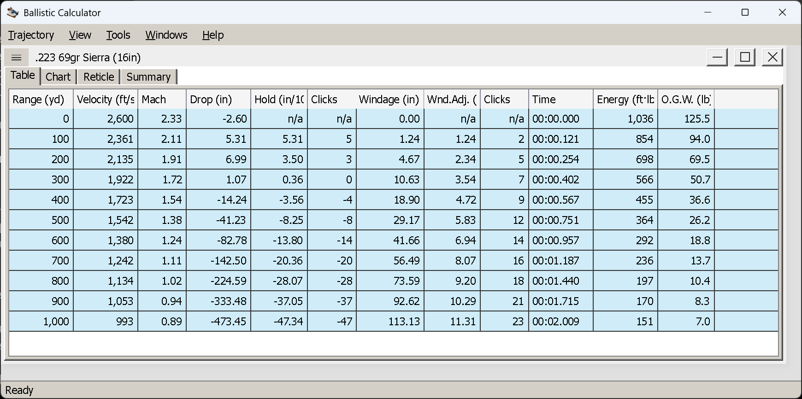
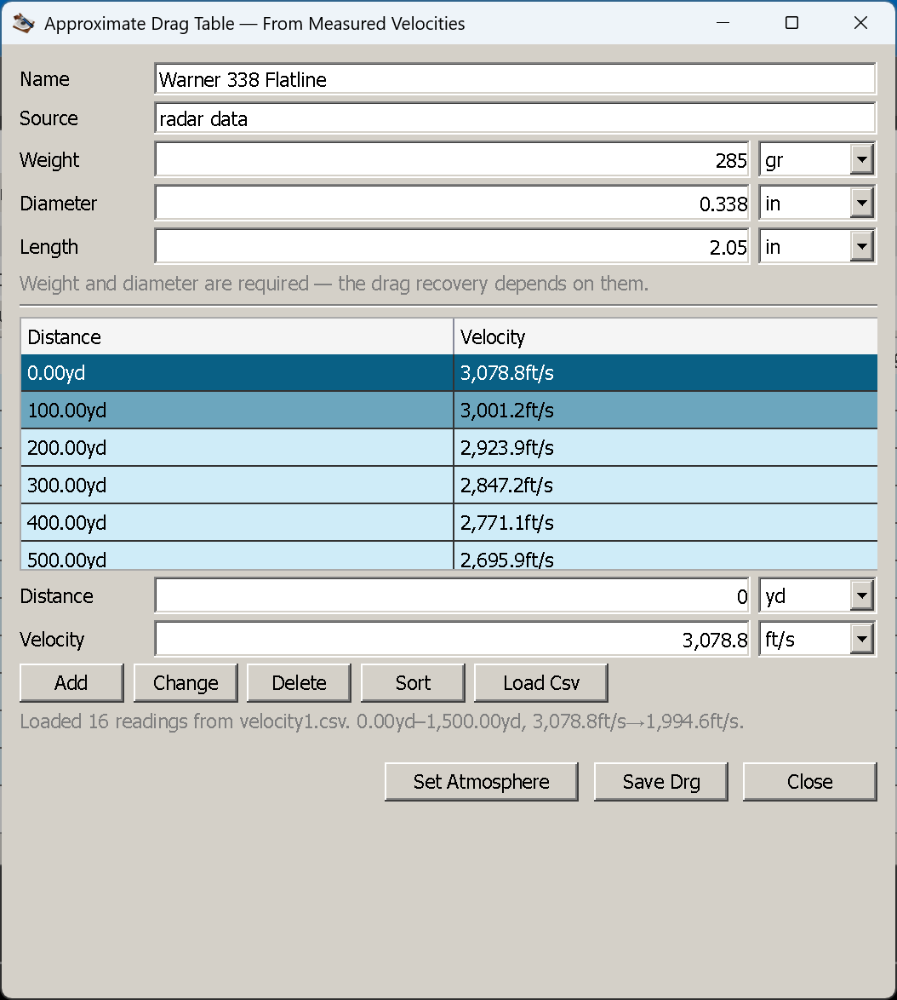

# What Ballistic Calculator 2 is

**Goal of this article:** decide whether this application answers your question — and understand what
kind of answer it gives — before you spend an evening typing loads into it.

Ballistic Calculator 2 is a free, open-source external-ballistics solver for **Windows, Linux and macOS**. You
describe a projectile, a rifle, the air and the wind; it computes the trajectory and reports it as a
table, a chart, a sight picture through your own reticle, and a summary of the shot's useful ranges.

It is the successor to the WinForms
[Ballistic Calculator .NET](https://github.com/nikolaygekht/ballistic.calculator.app), rewritten on
Avalonia UI to be genuinely cross-platform rather than Windows-under-Wine. The trajectory mathematics
is not ours: it comes from the
[BallisticCalculator](https://github.com/gehtsoft-usa/BallisticCalculator1) library, which is developed
and tested separately.

*Drop, windage, clicks, energy and time of flight out to 1,000 yd — .223 69 gr Sierra, 300 yd zero.
Click any image to open it full size.*

## What it is for

**Accuracy comparable to commercial and 4DOF solvers.** The engine integrates a 3DOF (point-mass)
model, plus the correction terms that actually show up on paper — spin drift, crosswind aerodynamic
jump and the Coriolis effect — and, more importantly, it accepts **measured drag curves**. That is
where real accuracy comes from. A point-mass solver running the projectile's own Cd curve tracks a 4DOF
solver closely; what 4DOF adds is the projectile's angular motion, not a better drag model. So rather
than approximating angular motion, this application concentrates on letting you supply, or build, the
actual curve.

**Truly cross-platform.** One codebase, native builds for Windows, Linux and macOS, no emulation layer. Every
release ships both.

**Android next.** The calculation and domain layers carry no desktop UI dependencies, so a touch-first
mobile application can be built on them. That work has not started.

## What it does

<table>
<tr>
<td align="center"> Sight picture</td>
<td align="center"> Loads compared</td>
<td align="center"> Hit probability</td>
<td align="center"> Drag table from radar data</td>
</tr>
</table>

### Trajectory

- 3DOF point-mass integration with **spin drift**, **crosswind aerodynamic jump** (Litz / Applied
  Ballistics) and the **Coriolis effect** (barrel azimuth plus shooter latitude)
- Uphill and downhill shots, scope cant, and multiple wind zones along the flight path
- Zeroing with a *different* cartridge, atmosphere or wind than the shot itself — zero supersonic,
  shoot subsonic
- Results as a **table**, a **chart**, and a **sight picture** through your own reticle; several
  trajectories can be compared on one chart, and any table exports to CSV

Those correction terms are computed from inputs, not assumed: spin drift and aerodynamic jump need the
rifling twist plus the bullet's diameter and length, and Coriolis needs the barrel azimuth and your
latitude. Leave them out and the corresponding term is simply **absent** — the number you get is the
trajectory without it, not an error message.

### Drag models

- All the standard curves — G1, G2, G5, G6, G7, G8, GI, GS, RA4
- **Custom drag tables** (`.drg`) — the projectile's own measured Cd curve
- **Approximating a drag table** you do not have, two ways: from a **multi-BC curve** (BC quoted at
  several Mach numbers, as many data sheets do), or from **measured downrange velocities** (radar or
  chronograph data)
- **Converting a ballistic coefficient between standard tables** — the everyday G1 ↔ G7 question, at a
  reference velocity you choose, with the accuracy caveat stated rather than buried

A library of radar-derived `.drg` tables for Lapua projectiles ships with the application.

### Analysis

- **Hit probability** — a Monte-Carlo estimate over your error budget: group size, shooting position,
  range and wind estimation error, and the ammunition's muzzle-velocity deviation. It reports the
  single-shot probability, how many shots a first hit needs at 50/75/90/95/98 %, and the impact scatter
  against the vital zone
- Point-blank range and the dead-zone span, near and far zero, and the distance where the bullet goes
  subsonic
- Moving-target lead, drawn as an aim-off box on the reticle

### Libraries and editors

- An ammunition library, and sight and barrel preset dictionaries, so nothing is typed twice
- A separate **reticle editor** — build your own reticle from lines, paths, circles, rectangles, text
  and BDC marks

## What it does not do

Worth knowing before you go looking for it:

- **No 6DOF or 4DOF angular motion.** Nothing about yaw, precession or transonic instability. See the
  reasoning above.
- **No ballistics primer.** This guide teaches the application; the physics is left to the literature
  in [Recommended reading](recommended-reading.md).
- **No load or reloading data**, and nothing about interior ballistics. Muzzle velocity is an input you
  measure or take from a box, never something the application predicts.
- **No online lookup.** Bullet data comes from you, from the shipped `.drg` library, or from a file you
  supply. Nothing phones home.

## Risk notice

The application performs a very limited simulation of a complex physical process and therefore makes a
great many approximations. The calculation results MUST NOT be considered as completely and reliably
reflecting the actual behaviour or characteristics of projectiles. While these results may be used for
educational purposes, they must NOT be considered reliable in any area where an incorrect calculation
could lead to a wrong decision, financial harm, or risk to human life.

THE CODE IS PROVIDED "AS IS", WITHOUT WARRANTY OF ANY KIND, EXPRESS OR IMPLIED, INCLUDING BUT NOT
LIMITED TO THE WARRANTIES OF MERCHANTABILITY, FITNESS FOR A PARTICULAR PURPOSE AND NONINFRINGEMENT. IN
NO EVENT SHALL THE AUTHORS OR COPYRIGHT HOLDERS BE LIABLE FOR ANY CLAIM, DAMAGES OR OTHER LIABILITY,
WHETHER IN AN ACTION OF CONTRACT, TORT OR OTHERWISE, ARISING FROM, OUT OF OR IN CONNECTION WITH THE
MATERIALS OR THE USE OR OTHER DEALINGS IN THE MATERIALS.

## Licence and source

GNU General Public License v2. Source, releases and the issue tracker are at
[github.com/nikolaygekht/ballistic.calculator.app.avalonia](https://github.com/nikolaygekht/ballistic.calculator.app.avalonia).

The engine and unit libraries it is built on are separate projects:
[BallisticCalculator](https://github.com/gehtsoft-usa/BallisticCalculator1) (the trajectory
mathematics) and [Gehtsoft.Measurements](https://github.com/gehtsoft-usa/Gehtsoft.Measurements) (units
and conversions). Both are open source, and the engine is the place to look if you want to check how a
number is produced.

## Next

[Installation and first run](installation.md) — from the Releases archive to a running application, and
where it keeps its files.

---

[← Contents](index.md)
