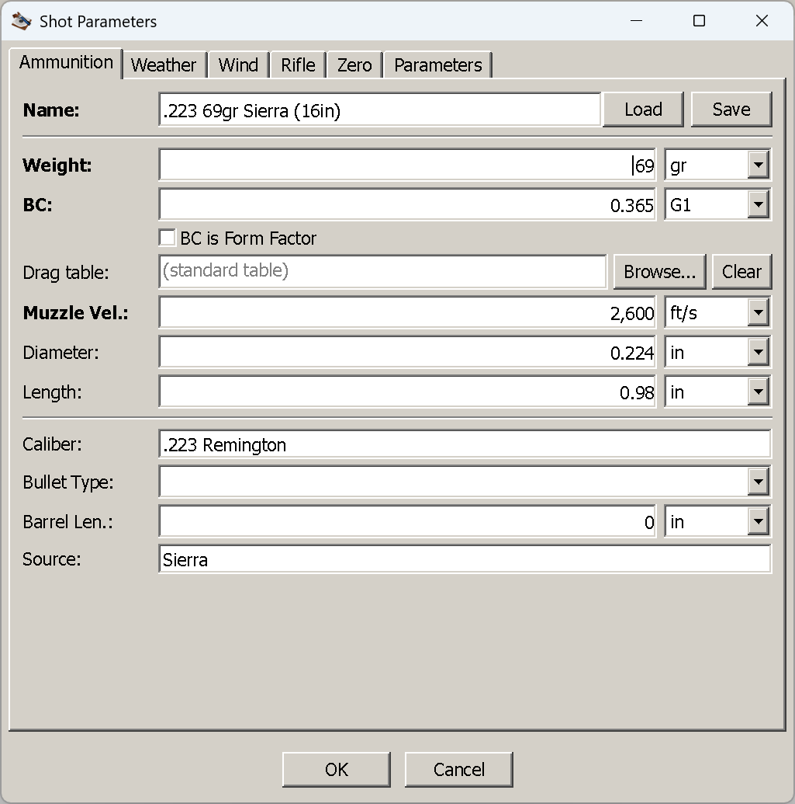
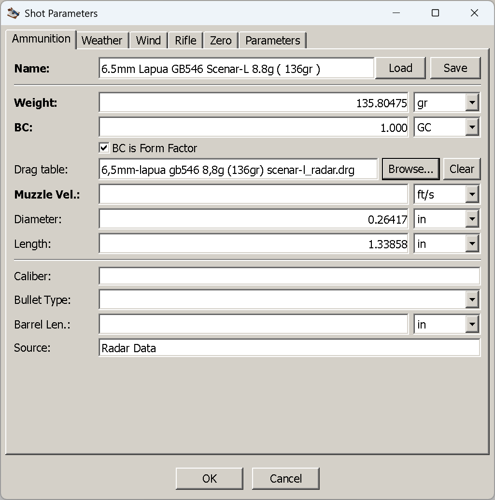

# The Ammunition tab

**Goal of this article:** describe a projectile completely enough for the terms you care about — by
hand, from a saved load, or from a measured drag curve — and know which fields change the answer and
which are only there to help you recognise the load later.

This is the first tab of the *Shot Parameters* dialog, and the only one that must be filled in: nothing
can be computed without a bullet. It is reached from [`Trajectory → New`](first-trajectory.md) or,
for a window already open, `View → Edit Parameters` (`Ctrl+E`).

*A .223 69 gr Sierra on a G1 coefficient of 0.365, imperial window.*

## The fields

**The bold labels are the ones the application cannot do without.** Everything else is either optional
or descriptive.

| Field | Imperial | Metric | What it is |
|---|---|---|---|
| **Name** | — | — | What this load is called. Also becomes the trajectory window's title and the default file name when you save it |
| **Weight** | grain | gram | Bullet weight |
| **BC** | — | — | The ballistic coefficient, plus the drag table it is quoted against — G1, G2, G5, G6, G7, G8, GI, GS, RA4, and **GC** for a custom curve. G1 is the default |
| BC is Form Factor | — | — | Read the number above as a **form factor** rather than a coefficient. See [when diameter is needed](#when-diameter-and-length-are-needed) — this switch makes the diameter mandatory |
| Drag table | — | — | The `.drg` file holding a measured curve, with `Browse…` and `Clear`. Empty reads *(standard table)* |
| **Muzzle Vel.** | ft/s | m/s | Muzzle velocity, from your chronograph or the box |
| Diameter | inch | mm | Bullet diameter. Optional — until it is not; see below |
| Length | inch | mm | Bullet length, nose to base. Optional in the same way |
| Caliber | — | — | Descriptive only — see [the last block](#caliber-bullet-type-barrel-length-and-source-are-notes-not-inputs) |
| Bullet Type | — | — | Descriptive only (FMJ, HP, …) |
| Barrel Len. | inch | mm | Descriptive only — the barrel the muzzle velocity was measured in |
| Source | — | — | Descriptive only — where the data came from |

Which units you see depends on the window's measurement system, chosen at `Trajectory → New`; see
[Your first trajectory](first-trajectory.md#first-imperial-or-metric).

**Name the load.** It is not enforced — the dialog will accept a blank name and compute the shot — but
the window title comes from it, so an unnamed load opens a window with an empty title bar, and several
of them are impossible to tell apart in the `Windows` menu.

## Entering a load by hand, and keeping it

The minimum is three numbers, and for most factory ammunition all three are printed or published:
**weight**, **BC** with the table it is quoted against, and **muzzle velocity**.

1. Type a **Name** — anything you will recognise: `.223 69gr Sierra (16in)`.
2. Enter **Weight**.
3. Enter the **BC** and pick its drag table from the dropdown beside it. Take the table from wherever
   you got the number: a G7 coefficient entered as G1 is simply a different bullet. If your data sheet
   gives a form factor instead of a coefficient, tick **BC is Form Factor**.
4. Enter **Muzzle Vel.** — measured in *your* barrel if you have a chronograph. A box figure is another
   rifle's answer.
5. Add **Diameter** and **Length** if you want spin drift and aerodynamic jump — see
   [below](#when-diameter-and-length-are-needed).
6. Optionally fill the descriptive block at the bottom, then press **Save**.

**Save** writes an `.ammox` file — by default into the `data/legacy-ammo` folder beside the application,
under the load's name — and stores the whole record: the three required numbers, the drag table,
diameter and length if you set them, a reference to the `.drg` file if you attached one, and all four
descriptive fields. Saving does not close the dialog and does not affect the shot; it is purely so you
never type this load again.

Saving is silent, including when it fails. If nothing appears in the folder you chose, the usual cause
is a folder the application cannot write to — see
[Installation](installation.md#where-your-settings-go).

## Loading a load you already have

**`Load`**, the button beside the name, opens a file dialog on `data/legacy-ammo` and accepts:

- **`.ammox`** — what this application saves.
- **`.ammo`** — the format of the original WinForms *Ballistic Calculator .NET*. Its sample library
  ships with this application, so there is a usable set of cartridges to try before you have saved
  anything of your own.

Loading **replaces the whole tab**: the three numbers, diameter and length, the descriptive block, and
any custom drag table the file refers to. It does not touch the other five tabs — the load changes, the
conditions and the rifle stay as you had them. A file that fails to load leaves the tab untouched and
says nothing, so if pressing `Load` seems to do nothing at all, suspect the file rather than the button.

**A loaded value keeps the units it was saved in.** This is deliberate — a load saved as `0.308 in` is
not rounded to a metric control's precision on the way in — but it means the tab can show a metric
weight in a window that is otherwise imperial. The shipped library has both: `7N6.ammo` is stored in
grams and metres per second, `45acp 230gr FMJ (4in).ammo` in grains and feet per second. The numbers are
correct either way and the calculation does not care; only the labels look inconsistent.

## Driving the shot from a measured drag curve

A `.drg` file is a projectile's **own measured drag curve** — the Cd against Mach that radar produced
for that bullet — and using one is the single biggest accuracy gain available in this application. A
large library of radar-derived Lapua tables ships in `data/drg`.

Press **`Browse…`** beside *Drag table* and pick a file. Five things happen at once:

- **BC becomes `1` with the table set to `GC`** — "custom curve". There is no coefficient to quote,
  because the curve itself is the drag model.
- **BC is Form Factor is ticked.** The form-factor-of-1 convention is what makes the file's own curve
  the answer rather than a scaled version of a standard one.
- **Weight, Diameter and Length are filled in from the file's header**, where it carries them, and
  converted to the window's units. Older `.drg` files store the length and source slots as zero; those
  are left alone rather than overwriting good values with nothing.
- **Name and Source are filled in from the header** — but only if you left them empty, so attaching a
  curve to a record you have already named does not rename it.
- **Muzzle Vel. is not touched, and stays your job.** A `.drg` describes the projectile, not the load:
  the file cannot know what your barrel does. This is the one field to check after every `Browse…`.

*A 6.5 mm Lapua Scenar-L on its radar curve. The BC unit is GC, the value 1.000, and the bullet
dimensions came out of the file — 135.80475 gr, Ø0.26417 in, 1.33858 in, the metric source values
carried across without being rounded to the control's precision.*

**`Clear`** removes the curve. Because a GC coefficient is meaningless without a table, clearing also
resets the BC to `0.5 G1` and unticks the form-factor switch — a deliberately obvious placeholder
rather than a number you might mistake for real.

Two things worth knowing about the reference that gets stored:

- **The file is referenced, not copied.** The record keeps the file *name*; the table is read fresh at
  calculation time. Editing the `.drg` changes your next answer.
- **It is found again by name.** If the stored path no longer exists, the same file name is looked for
  in `data/drg` and its subfolders. So a `.ammox` or `.trajectory` you share works on another machine
  as long as the `.drg` is one of the shipped tables, or the recipient drops it into `data/drg`. If it
  is nowhere to be found, the shot cannot be computed — a GC coefficient has no curve to fall back on.

If you do not have a curve for your bullet,
[`Tools → Approximate Drag Table`](approximating-a-drag-table.md) builds one from a multi-BC curve or from
measured downrange velocities.

## When diameter and length are needed

Both are marked optional, and for a plain coefficient on a standard table they genuinely are — the
answer is identical whether you fill them in or not. They stop being optional in three cases:

| You want | You must supply | Otherwise |
|---|---|---|
| **Spin drift** — the horizontal drift a spin-stabilised bullet accumulates downrange | **Diameter and length**, plus the barrel's **twist** on the Rifle tab | The term is silently absent. No warning: the windage column simply contains only wind |
| **Crosswind aerodynamic jump** — the vertical shift a crosswind imparts at the muzzle | **The same three**, plus at least one wind zone | Silently absent, exactly as above |
| **Any shot using a form factor** — including *every* `.drg`/GC shot, since those are form-factor-1 by construction | **Diameter** (and weight, which is always required) | The shot **cannot be computed at all**: a form factor is turned into a coefficient through the bullet's sectional density, and that needs the diameter |

The first two are the important asymmetry to understand: **leaving a field empty does not produce a
warning, it produces a different trajectory.** A shot with no bullet dimensions is not wrong — it is a
trajectory with no spin drift and no aerodynamic jump in it, which at 300 yd nobody would notice and at
1,000 yd is inches of windage. If you have the numbers, enter them; bullet manufacturers publish both,
and `.drg` files usually carry them.

The third is a hard stop rather than a quiet omission, and the case that catches people is the middle
one in disguise: attaching a `.drg` whose header has no diameter. `Browse…` fills the field when the
file carries it — check that it did, and type it in when it did not.

## Caliber, bullet type, barrel length and source are notes, not inputs

The block at the bottom of the tab — **Caliber**, **Bullet Type**, **Barrel Len.** and **Source** —
**never reaches the calculation.** Not one of the four is read by the solver, and changing any of them
cannot change a single number in the table.

They exist so that a saved load is recognisable a year later: which cartridge it belongs to, what kind
of bullet it is, the barrel length the muzzle velocity was measured in, and where the data came from.
They are stored with the load — in the `.ammox` file when you press **Save**, and in the
`.trajectory` file when you save the shot — and are filled in for you by `Browse…` where a `.drg`
header supplies the name and source.

**Barrel Len. deserves the warning**, because it is the one that looks like an input: it is a *label*
recording the test barrel behind your muzzle velocity, not something the application converts a
velocity with. Entering `16 in` next to a 24-inch barrel's velocity does not correct anything — it only
records a note that contradicts the number beside it. If you want the velocity from your barrel, measure
it.

## Things that catch people out

- **A G7 number entered as G1.** Nothing warns you; the trajectory is simply a different bullet's.
  Always take the table from the same place as the number.
- **Muzzle velocity after a `Browse…`.** The field is left empty on purpose, and an empty required
  field is easy to walk past.
- **Diameter with the form-factor switch on.** Required, including for every `.drg` shot.
- **A blank name.** Legal, but the window title goes with it.
- **Units after a `Load`.** The file's own, not the window's.

## Next

[The Weather tab](weather-tab.md) — the air the bullet has to fly through, and the one field on it that
catches everybody.

---

[← Contents](index.md)
