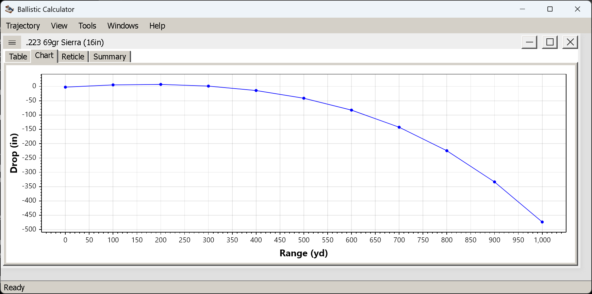

# The chart view

**Goal of this article:** plot the variable you actually want against range, and get a readable curve
rather than a flat line at the bottom of the frame.

The chart shows one variable of the same trajectory the table lists, against range. It is for the shape of
things — where velocity falls off a cliff, where the trajectory crosses the sight line, how two loads
diverge — not for reading a number off, which the table does better. Reach it with `Ctrl+C` or
`View → Show → Chart`.

*Drop against range, one series, with a marker at each step of the run.*

## Choosing what to plot

`View → Chart` offers five variables:

| Variable | Y axis | What it is good for |
|---|---|---|
| **Velocity** | ft/s or m/s | Where the load runs out of steam; the shape is steepest early |
| **Mach** | bare number | Where the bullet goes transonic — the line crossing 1.0 |
| **Drop** | in or cm | The trajectory itself. See the two-curve mode below |
| **Windage** | in or cm | Wind, spin drift and Coriolis combined, growing faster than linearly |
| **Energy** | ft·lb or J | Threshold questions — where the load falls below a number you care about |

The X axis is always range in the window's unit. Points are marked at each step of the run, so a coarse
step gives a chart with visible markers and a fine step a smooth line — the underlying trajectory is the
same either way (see [the Parameters tab](parameters-tab.md#range-and-step-what-a-fine-step-does-and-does-not-cost)).

## The one mode that shows you something new

Set `View → Chart → Drop` **and** `View → Drop → Over Muzzle Level`, and the chart draws **two curves**:
the bullet's path against the horizontal through the muzzle, and the **line of sight** as its own line.

That is the classic textbook picture, and it is the one thing here the table cannot show you: the bullet
starting below the sight line, crossing it at the near zero, arcing above, and crossing back at the zero
distance. The vertical gap between the two curves *is* the drop over line of sight — the column you hold
by. Seeing the two lines makes the near zero, the mid-range rise and the far zero obvious in a way a
column of numbers does not.

On a level shot with `Over Line of Sight` selected you get one curve instead, which is the same
information with the sight line flattened onto the axis.

## Zoom, and the flat-line problem

The plot pans and zooms with the mouse. Zoom into a stretch of range — say 800 to 1,000 yd — and you will
often find the curve pressed flat against the bottom of the frame: the Y axis still spans the whole
trajectory, including the part you zoomed away from.

**`View → Chart → Zoom Y Axis to Visible Range`** (`Ctrl+Shift+Z`) fixes exactly that. It rescales the Y
axis to the points inside the current X range, so the detail you zoomed in for becomes visible. It is the
menu item you will use most on this view.

Re-selecting a variable from `View → Chart` re-autoscales both axes, which is the quickest way back to a
sane view.

## More than one trajectory

`View → Compare → Add` puts another open trajectory onto the same chart, and a legend appears naming each
one. This is where the chart earns its keep — two loads' numbers interleaved in a table are hard work,
while two curves separating past 450 yd tell the story at a glance.

*Two loads on one chart. The heavier, higher-BC bullet drops visibly less at 1,000 yd.*

A legend also appears in the two-curve drop mode described above, naming the bullet path and the line of
sight. With a single series and a single trajectory there is nothing to disambiguate, so no legend is
drawn.

Comparison has its own article to come — how the window works, what it does with mismatched units, and
`View → Compare → Remove Last Added`.

## Things worth knowing

- **The chart follows the window's settings.** Measurement system, angular units and the drop convention
  all apply here; changing them redraws the chart.
- **A curve that ends early is not a truncated chart.** The run itself stopped — the load went subsonic
  and slow, or fell 10,000 ft. Same reason the table ends early.
- **Windage can be negative.** Positive is left, as in the table, so a right-twist rifle with no wind
  gives a curve heading downward.

## Next

[The reticle view](reticle-view.md) — the same trajectory as a sight picture through your own reticle.

---

[← Contents](index.md)
