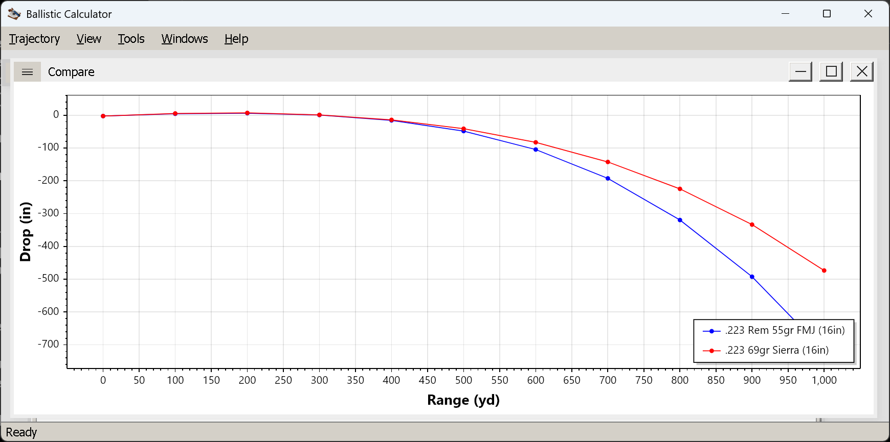

# Comparing loads

**Goal of this article:** put two or more solutions on one chart and read the difference between them —
which is a different question from what any single solution says.

Two tables of numbers are hard to compare; two curves are not. The Compare window exists for the
questions that only have an answer relative to something else: is the heavier bullet worth its lower
velocity, where do these two loads cross over, which of them is still supersonic at 900.

*`.223 Rem 55gr FMJ (16in)` against `.223 69gr Sierra (16in)`. The curves separate past ~450 yd, and the
heavier, higher-BC bullet drops visibly less at 1,000.*

## Adding and removing

Comparison is built one trajectory at a time, from the windows you already have open.

1. Compute a shot as usual, so its trajectory window is open and **active**.
2. **`View → Compare → Add`**. The first add creates a window titled **Compare** and puts that
   trajectory in it.
3. Activate another trajectory window and add it too. It joins the **same** Compare window — there is only
   ever one — and that window comes to the front.

**`View → Compare → Remove Last Added`** takes the most recent one off again, and when the last series
goes the Compare window closes itself.

Note the asymmetry in the menu, because it decides which window you need to be looking at:

| Menu item | Enabled when |
|---|---|
| `Compare → Add` | a **trajectory** window is active — it adds *that* window's solution |
| `Compare → Remove Last Added` | the **Compare** window is active |

So if *Add* is greyed out, you are focused on the Compare window; click a trajectory window first.

## Series are named after the ammunition

Each curve is labelled with the **ammunition name** from the Ammunition tab, and an unnamed load becomes
the literal string `Trajectory`. Two unnamed loads therefore produce two curves both called `Trajectory`,
which defeats the purpose of a legend — one more reason to
[name your loads](ammunition-tab.md#the-fields).

## It is a snapshot, not a live link

**The Compare window holds each trajectory as it was when you added it.** Recompute the source window —
`View → Edit Parameters`, change something, OK — and the curve in the Compare window does not move. To
refresh it you remove and add again.

That is worth knowing because it will otherwise confuse you, and because it turns into a useful trick once
you expect it:

> Add the shot. Edit the source — a different zero, a stiffer wind, a heavier bullet — and add it again.
> The Compare window now holds both versions, before and after, from a single trajectory window.

This is the quickest way to see what one input is worth. The only wrinkle is that both series carry the
same ammunition name, so change the name along with the input if you need to tell them apart.

## Mixed units are not a problem

The Compare window has its own measurement system, angular units, drop convention and chart variable,
inherited from whichever window created it. Everything added afterwards is **restated in those units**, so
a metric shot and an imperial one can go on the same chart without converting anything by hand.

While the Compare window is active, all four of those settings apply to it: `View → Measurement System`
(`Ctrl+Shift+I` / `Ctrl+Shift+M`), `View → Angular Units`, `View → Drop`, and `View → Chart` all retarget
the comparison rather than the trajectory window you built it from.

## The chart itself

It is the same chart control as the [chart view](chart-view.md), with the same five variables and the same
`Zoom Y Axis to Visible Range` (`Ctrl+Shift+Z`) — which you will need more here, since comparisons are
usually about a stretch of range rather than the whole curve.

A legend is always drawn once there is more than one trajectory, naming each series. If you also select
`View → Drop → Over Muzzle Level`, every trajectory contributes **two** curves — its bullet path and its
line of sight — and the legend names them per trajectory (`.223 69gr Sierra: Drop (in)` and
`… : Line of Sight Elevation (in)`). That gets crowded quickly; for a multi-load comparison, *Over Line of
Sight* is the readable choice.

## What to actually compare

The five chart variables answer different questions, and the useful ones in comparison are not the same as
the useful ones for a single load:

- **Drop** — the headline question. Two loads that agree at 300 can be a foot apart at 1,000; the *shape*
  of the divergence tells you whether it is velocity or BC doing the work. A faster, lighter bullet
  usually wins early and loses late, and the crossover is visible as the point where the curves meet.
- **Velocity** — where each load falls off. A high-BC bullet retains velocity better, and the curves
  fanning out is exactly that.
- **Mach** — which load is still supersonic at the distance you care about. The transonic region is where
  drag predictions are least trustworthy, so a load that stays above it further is worth something beyond
  the numbers.
- **Windage** — with the same wind entered for both, this compares wind sensitivity, which is often the
  real difference between two loads at long range and the one shooters most underestimate.
- **Energy** — for threshold questions: which load is still above a legal or ethical minimum at a given
  range.

**Compare fairly.** The comparison is only as honest as the inputs: same atmosphere, same wind, same zero
distance, same maximum range. It is easy to build a chart that proves a load is better because you gave it
a 300 yd zero and its rival 100. If you are testing one variable, change one variable.

## Things that catch people out

- **`Add` greyed out.** You are on the Compare window; select a trajectory window.
- **The curve did not update after an edit.** It is a snapshot; remove and re-add.
- **Two curves called `Trajectory`.** Name the loads.
- **Only one Compare window.** A second `Add` never opens a second window, it joins the existing one.
- **Six curves from three loads.** You have *Over Muzzle Level* selected; switch to *Over Line of Sight*.

## Next

[The reticle editor](reticle-editor.md) — the separate application that builds the reticles the sight
picture draws on.

*(The summary view, the fourth of the four trajectory views, is still to be written.)*

---

[← Contents](index.md)
