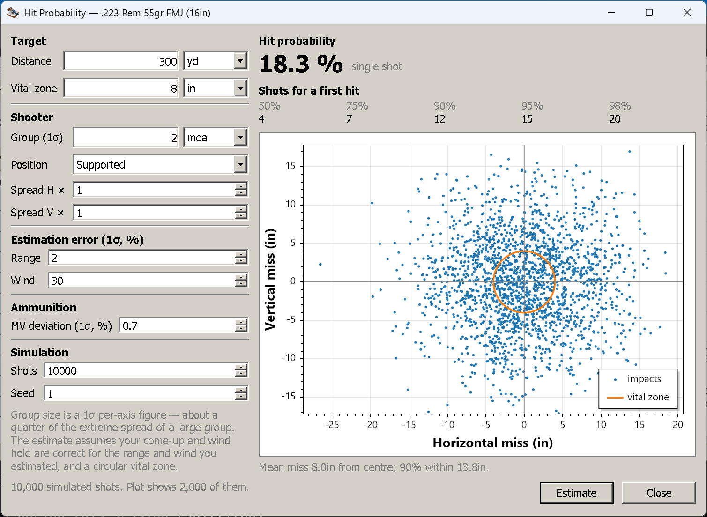

# Hit probability

**Goal of this article:** build an error budget that is not wishful, and read the three answers it produces
— including what the estimate quietly assumes you got right.

Every other view in this application answers "where will the bullet go". This one answers a different and
more uncomfortable question: **given everything you do not know exactly, how often would this shot hit?**

`Tools → Hit Probability…` is enabled while a trajectory window is active, because it estimates against
*that* shot — its load, its zero, its air, its wind.

*18.3 % single-shot at 300 yd on an 8 in vital zone, with a 2 MOA supported group. 10,000 shots simulated,
2,000 plotted.*

## How it works, in one paragraph

It is a **Monte Carlo**. Each simulated shot perturbs the four things you are uncertain about — muzzle
velocity, your range estimate, your wind estimate, and your aim — and lands where the resulting
(mis-)corrected hold puts it relative to the target centre. Do that ten thousand times and the fraction
landing inside the vital zone is the single-shot probability. Nominal conditions, with every error at zero,
land dead centre.

## The inputs

### Target

| Field | What it is |
|---|---|
| **Distance** | The target's range. **Independent of the shot's own maximum range** — you can ask about 700 yd on a trajectory computed to 1,000 |
| **Vital zone** | The **diameter** of a **circular** target area |

The vital zone is a circle, which is an approximation you should keep in mind: real vital zones and real
scoring rings are not round, and a tall narrow target is treated as neither tall nor narrow.

### Shooter

| Field | What it is |
|---|---|
| **Group (1σ)** | Your group as a **one-standard-deviation, per-axis angle**, from a supported position |
| **Position** | A preset that widens that group: Supported, Prone, Kneeling, Standing, or Custom |
| **Spread H ×** / **Spread V ×** | The multipliers the position applies. Editable — changing them selects *Custom* |

**The group size is the input people get wrong, and it is worth getting right.** It is *not* the extreme
spread of your best five-shot group. The engine takes it directly as a per-axis standard deviation, and the
guidance from the library that computes it is:

- Use the **best group of up to about ten shots from a fully supported position**.
- That is roughly **4 MOA for an ordinary shooter and rifle, 1 MOA for a precision setup**.
- **The extreme spread of a large group is about four times this figure.**

So if you measure groups as extreme spread — as most people do — divide by about four before typing it in.
Enter your 1 MOA extreme spread as 1 MOA and you have told the application you are four times the shooter
you are, and it will return a probability to match.

The position multipliers are applied on top:

| Position | H × | V × |
|---|---|---|
| Supported | 1 | 1 |
| Prone | 2 | 2 |
| Kneeling | 4 | 3 |
| Standing | 5 | 4 |

Standing is five times the horizontal scatter of a bipod, which sounds harsh until you compare a standing
group with a supported one.

### Estimation error and ammunition

| Field | What it is |
|---|---|
| **Range** — estimation error (1σ, %) | How well you know the distance, as a percentage of it |
| **Wind** — estimation error (1σ, %) | How well you know the wind, as a percentage of its speed |
| **Ammunition** — MV deviation (1σ, %) | How consistently the load leaves the barrel, as a percentage of muzzle velocity |

The first two are **your** errors; the third is the **ammunition's** property, not a mistake you make. A
chronograph gives you the third directly: standard deviation divided by mean velocity. Good factory match
ammunition sits under 1 %; a mixed lot can be several times that.

For the first two, be honest rather than flattering. A laser rangefinder is a fraction of a percent; a guess
at 600 yd across a valley can be 10 %. Wind is worse: if you cannot tell 8 mph from 12, that is 20 %.

### Simulation

| Field | What it is |
|---|---|
| **Shots** | How many to simulate — between **1,000** and **50,000**, default 10,000 |
| **Seed** | The random seed. Fixed by default, so repeated runs give the same answer |

Below 1,000 shots the Monte-Carlo noise (about ±1.3 % at 1,000) swamps what you are trying to measure.
Clearing the seed makes every run re-roll, which is a good way to *see* that noise: run it five times and
watch the last decimal move.

Nothing is computed until you press **Estimate**.

## The three outputs

**Single-shot probability**, the headline: the fraction of simulated shots inside the vital zone. Beside it
the dialog reports the **mean radial miss** and the **radius containing 90 % of the impacts** — the two
numbers that say *how* you are missing, which the probability alone does not.

**Shots for a first hit**, at 50 %, 75 %, 90 %, 95 % and 98 %: how many shots you would need for at least
one hit with that confidence. This is the row that reframes the question honestly — an 18 % single-shot
chance means four shots for a coin-flip and twenty for near-certainty, which tells you whether the shot is
worth taking at all.

**The impact scatter**, with the vital-zone circle drawn on it. The shape is the diagnosis: a tall narrow
cloud means velocity and range error dominate, a wide flat one means wind, and a round one means your group
is the limit. The plot is **thinned to at most 2,000 markers** by even sampling, so a 50,000-shot run
displays without choking — the probability is computed from all of them, only the drawing is sampled.

## What the estimate assumes you got right

This is the part to read before quoting a number to anyone.

- **The come-up and the wind hold are correct for the range and wind you estimated.** The tool does not
  model you dialling the wrong elevation; it models you dialling the right elevation *for a range you
  estimated wrongly*. There is no allowance for reading the table wrong, mis-counting clicks, or forgetting
  the incline.
- **Dialled clicks from the Parameters tab are deliberately ignored.** The model computes the hold itself,
  so a scope already dialled for the target would count the hold twice.
- **The vital zone is a circle**, and every impact inside it counts as a hit regardless of where.
- **The errors are independent and normally distributed.** Real errors are neither — wind misjudgement is
  correlated with the conditions that make ranging hard — so the tails are optimistic.
- **Nothing here models the rifle changing.** A fouling shot, a shifting zero, a barrel heating up: not
  present.

Which is why this is a tool for **comparing** decisions rather than for certifying one. It is very good at
"how much does dropping from standing to prone buy me", "is my wind call or my group the limit here", "how
far can I take this load before the numbers stop being respectable". It is not a licence.

## A worked reading of the screenshot

18.3 % single-shot, at 300 yd, on an 8 in vital zone, from a supported position with a 2 MOA group. Two
things follow from that, and both are more useful than the percentage:

- **The group is doing the damage.** 2 MOA at 300 yd is about 6 in of 1σ scatter against an 8 in circle;
  no amount of better wind reading fixes that.
- **The shots-for-a-first-hit row — 4 / 7 / 12 / 15 / 20 — says the shot is not really available.** If it
  takes twelve shots for a 90 % chance of one hit, the honest answer is to get closer, get steadier, or
  shoot a better group before shooting at this target.

That is the tool working as intended: not telling you the probability, but telling you what to fix.

## Next

[Ammunition library and presets](library-and-presets.md) — saving loads, sights and barrels so nothing is
typed twice.

---

[← Contents](index.md)
