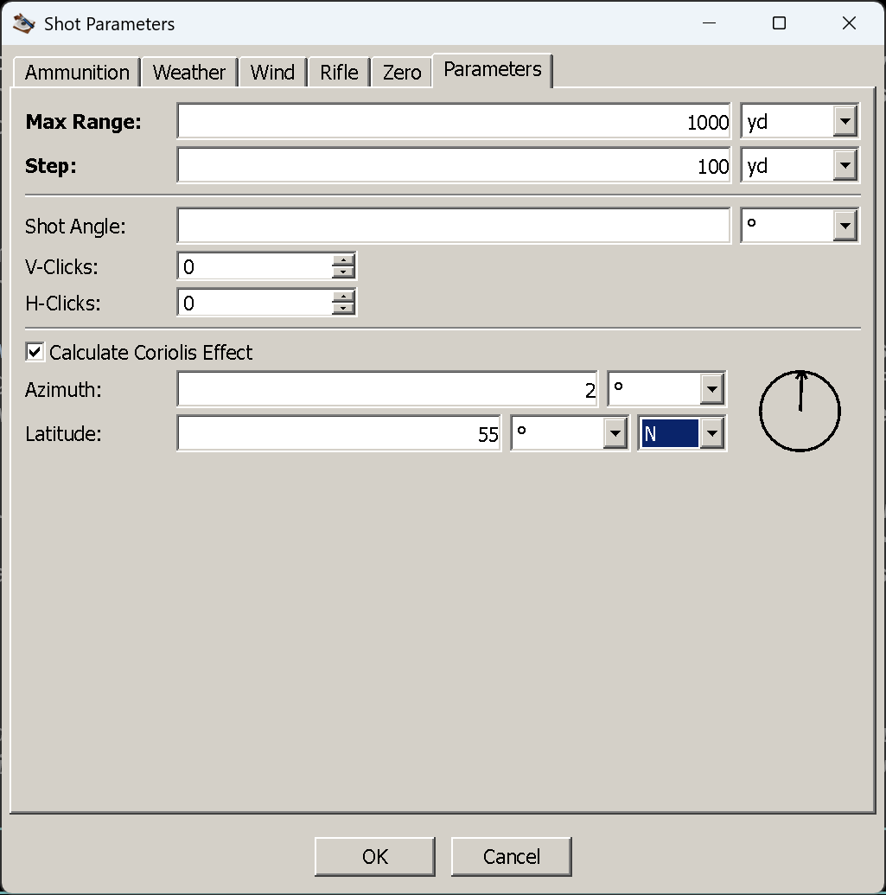

# The Parameters tab

**Goal of this article:** set how far the solution runs and how finely it is reported, describe an
inclined shot and any clicks already on the turret, and decide whether the Coriolis effect is worth
entering — with measured numbers rather than folklore.

This is the last tab, and the only one that is about **the run** rather than about the rifle, the load or
the air.

*Coriolis enabled, with an azimuth dial and a latitude of 55° N.*

## The fields

| Field | Imperial | Metric | What it is |
|---|---|---|---|
| **Max Range** | yard | metre | How far to compute |
| **Step** | yard | metre | The spacing of the rows in the table |
| Shot Angle | degrees | degrees | The incline of **this** shot. Positive is uphill |
| V-Clicks | count | count | Elevation clicks already on the turret, −200 to 200 |
| H-Clicks | count | count | Windage clicks already on the turret |
| Calculate Coriolis Effect | — | — | Checkbox enabling the two fields below |
| Azimuth | degrees | degrees | Compass bearing of the shot, 0 = North, clockwise. The dial sets it too |
| Latitude | degrees | degrees | 0 to 90, with an **N**/**S** selector beside it |

**Max Range** and **Step** are the two the tab cannot do without. Left completely empty, the tab defaults
to **1,000 yd/m in 100 yd/m steps**, with no angle, no dialled clicks and no Coriolis.

## Range and step: what a fine step does and does not cost

The step is how far apart the rows are: 1,000 yd in 100 yd steps is eleven rows, in 10 yd steps a hundred
and one. What is worth knowing is what that *does not* change.

**The step is presentation, not precision.** The solver does not integrate in your step — it takes your
step, halves it, and if that is still more than about a metre, divides it down by powers of ten. Whatever
you ask for, the internal step ends up somewhere around a tenth to half a metre. So a 100 yd step is not a
coarse calculation reported coarsely; it is the same calculation reported in eleven rows. Asking for 10 yd
rows gives you ninety more rows of the same trajectory, and costs a longer table rather than a longer
wait.

Two related things that surprise people:

- **The reticle and summary views do not use your step at all.** They run their own fine trajectory
  internally — 2.5 m out to at least 1,500 m — because BDC marks and the point-blank corridor need
  resolution the table's step cannot give. Changing the step will not move them.
- **The table can stop before your maximum range.** The solver abandons a shot once the bullet falls below
  **50 ft/s** or has dropped more than **10,000 ft**, so a subsonic load asked for 2,000 yd simply ends
  where it ran out. Rows stop; nothing errors. That is the answer to "why does my table end at 1,400".

Set the maximum range to something the load can actually cover, and the step to whatever you want to read
— 100 for a general picture, 25 or 10 when you are looking for the precise crossing of something.

## Shot angle: the incline of this shot

The angle of the line of sight to your target, **positive uphill, negative downhill**, in degrees. It
matters because gravity does not care which way you are pointing: on an inclined shot only part of it acts
across the line of sight, so a target 500 yd away up a 30° slope needs less elevation than a target 500 yd
away on the flat.

Two cautions:

- **This is not the Zero tab's shot angle.** That one describes the slope you were standing on when you
  *zeroed* — almost always level. This one describes the shot you are computing. Putting an incline in the
  wrong one moves the answer the wrong way.
- **It is the angle to the target, not the terrain.** A rangefinder with an inclinometer reads it directly;
  guessing it from how steep the hillside looks is how 30° becomes 15°.

## Dialled clicks: what is already on the turret

**V-Clicks** and **H-Clicks** are counts, not angles: how many clicks you have *already* wound onto the
turret for this shot. The solution is then computed with the barrel already tilted, so the table shows
what is **left to hold** rather than the full correction.

That makes them useful in two situations: checking a dialled solution ("I have 20 up — where does that put
me at 700?"), and working a hold-over from a partial dial.

**They need click values on the [Rifle tab](rifle-tab.md#click-values-buy-you-two-things).** A click count
means nothing without a click size, and if that field is empty the count is **silently ignored** — no
warning, no effect, the solution comes back as if you had dialled nothing. If dialling clicks appears to
change nothing, that is why.

## The Coriolis effect: two effects, and when they are worth it

Tick **Calculate Coriolis Effect** and two fields open up: the **azimuth** — the compass bearing from you
to the target, 0 = North, increasing clockwise, settable by clicking or dragging the dial — and your
**latitude**, as a magnitude with an **N**/**S** selector.

The earth's rotation moves the bullet two different ways, and they depend on different things:

| | Depends on | Direction | Measured at 1,000 yd |
|---|---|---|---|
| **Horizontal** | Latitude only — **not** azimuth | Right in the northern hemisphere, left in the southern | **3.8 in** right at 45° |
| **Vertical** (Eötvös) | Azimuth, strongest due east or west | East shoots slightly **flat**, west slightly **low**; nothing due north or south | **±4.9 in** at 45° |

Those figures are measured, not quoted: a .223 69 gr at 2,600 ft/s with a 100 yd zero, at 45° latitude,
with no wind. The same shot at **600 yd** shows **1.1 in** of horizontal drift, and at 300 yd the whole
effect is smaller than the thickness of your crosshair.

So, plainly:

- **Inside 500 yd it is noise.** An inch at 600 is less than your group and far less than your wind call.
  Leave the checkbox alone.
- **Past 800–1,000 yd it stops being noise** — four inches of drift plus up to five of vertical is a miss
  on a small target, and it is systematic rather than random, so unlike wind it does not average out.
- **At extreme long range it is not optional**, and neither is knowing your bearing.
- **If you know your latitude but not your bearing**, enter the latitude alone. You then get the horizontal
  part — which depends only on latitude — with no vertical component, and that is a more honest answer
  than a guessed azimuth.

Note that the vertical effect is why a due-east and a due-west shot from the same position need different
elevation at the same distance. If you have ever seen a range log where the morning and afternoon targets
disagreed on a still day, this is a candidate.

## Things that catch people out

- **Dialled clicks with no click size.** Silently ignored; the Rifle tab is where the fix is.
- **The table ending short of the maximum range.** The load ran out of velocity, or dropped 10,000 ft.
- **Expecting a finer step to give a better answer.** It gives more rows of the same answer.
- **Expecting a finer step to change the reticle or summary.** Those views use their own fine trajectory.
- **This tab's shot angle versus the Zero tab's.** One is the shot, the other is the zeroing.
- **Coriolis without a latitude.** The checkbox alone does nothing; the numbers are what drive it.

## Next

[Reading the table](reading-the-table.md) — every column, and the two conventions behind the drop and
windage figures.

---

[← Contents](index.md)
