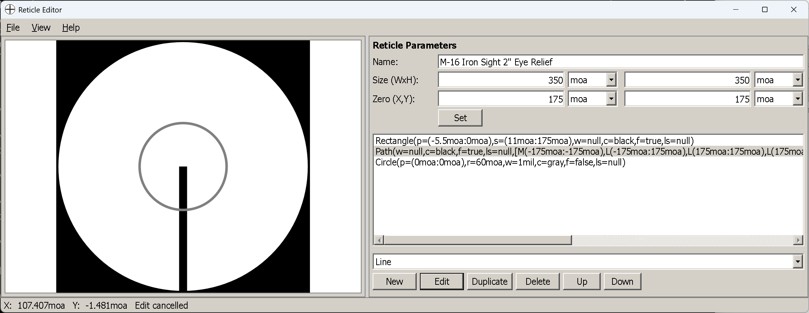

# The reticle editor

**Goal of this article:** know what the reticle editor is for, when you need it, and how the window is laid
out. The three articles after it cover the work itself.

The editor is a **separate application** in the same folder as the calculator — `ReticleEditor.exe` on
Windows, `ReticleEditor` on Linux. It creates and edits `.reticle` files: the reticle definitions the
calculator's [reticle view](reticle-view.md) draws your solution onto.

<a href="screenshots/reticleeditor.png"></a>

*An M16 iron-sight picture mid-edit: the render on the left, parameters, element list and operations on the
right, cursor coordinates and the last action in the status bar.*

## Why it exists

Because the sight picture is only as truthful as the reticle behind it. The
[reticle view](reticle-view.md) tells you where a hold lands *in your reticle* — which marks to use, whether
a target fits between them, where a moving-target lead sits. All of that is worthless if the marks are on
the wrong subtensions.

Two dozen reticles ship in `data/reticle` — measuring grids (`MILDOT`, `MOA-GRID`, `H58`, Leupold's `CCH`
and `CMR-MIL`), hunting and military pictures (`GERMAN4`, `PSO-1`, an M16 iron sight), and a dozen-odd
renderings of real optics with their drop ladders: Trijicon ACOGs, V-COGs and Hurons, Elcan Specters and
Leupold CMR-Ws. `data/reticle/README.md` indexes them in two tables — load-calibrated and geometric — and
each reticle has a companion `.md` beside it with the pattern and its calibration in full. They cover the
common patterns, but your scope's reticle is quite possibly not among them, and this is what you use to
describe it.

Three other reasons people end up here:

- **A simplified reticle to read holds from.** A bare cross with marks at the ranges you actually shoot is
  often more useful on screen than a faithful copy of a busy hunting reticle.
- **BDC anchors for your load.** A reticle can carry BDC points — positions the calculator labels with
  *distances* from the current trajectory. Put them on your reticle's real marks and the sight picture
  tells you which mark is 400.
- **Iron sights.** The shipped M16 picture is an aperture and a post, not a crosshair, and it works the
  same way.

## What it is not

It is not a drawing program. There is **no freehand, no dragging, no zoom or pan, and no undo**. Every
element is described by numbers you type — an angular position, an angular size — and the preview shows the
result. That sounds austere, and it is the right trade: a reticle is a measuring instrument, and 1.5 mil
means 1.5 mil, not "about here".

## Letting an AI assistant draw it instead

A busy reticle is a lot of typing — a mil-dot grid is dozens of elements, each with its own coordinates.
If you use **Claude Code** or **Codex**, there is a skill that writes the file for you:
[**reticle-designer**](https://github.com/gehtsoft-usa/BallisticCalculator1/tree/main/SKILL/SKILLS/reticle-designer),
in the original BallisticCalculator repository.

You describe the reticle in plain language — the angular units, the field of view, the central aiming
feature, hash spacing, a holdover ladder or wind grid, labels and colours, or simply the name of a
commercial reticle to imitate (H58, TReMoR, MOAR) — and it emits a `.reticle` file in the same BXml format
this editor reads, plus an SVG preview and a subtension table to check it against.

Drop the result into `data/reticle` and it opens here like any other file, so the editor becomes the place
you *adjust* a generated reticle rather than the place you type every element by hand. Worth knowing about
before you hand-write the XML yourself: the format ignores what it does not understand, so a typo is a
silently missing element rather than an error.

## The window

| | |
|---|---|
| **Left** | The reticle as it will look, scaled to fit and centred. It redraws after every change |
| **Right, top** | [Reticle parameters](reticle-parameters.md) — name, size, zero, and a **Set** button |
| **Right, middle** | The element list, each element spelled out as text (`Circle(p=(0mil:0mil),r=6mil,w=0.01mil,c=black)`) |
| **Right, bottom** | The element type dropdown and the operations: **New**, **Edit**, **Duplicate**, **Delete**, **Up**, **Down** |
| **Status bar** | The cursor's angular position, and a message reporting the last action |

The splitter between the two halves can be dragged, and its position — along with the window size and the
font size — is remembered between sessions.

The **View** menu holds three things worth knowing about:

- **Increase / Decrease Font Size** (`Ctrl`+`+` / `Ctrl`+`−`) — the editor's own text, useful on a dense
  element list.
- **Coordinate Display Units** — `Mil`, `MOA`, `in/100yd`, `cm/100m`. This changes only the **status bar
  readout**, not the reticle. It follows the reticle's own unit when you open a file.
- **Highlight Current Item** — redraws the selected element in blue on top of the reticle, which is how you
  find out which of forty lines you have selected.

## Files

Reticles are XML, saved as `.reticle`, and both the open and save dialogs start in the `data/reticle`
folder — the same folder the calculator's `Load…` button looks in, so anything you save there is
immediately available to the sight picture.

| | |
|---|---|
| `Ctrl+N` | New — a 10 × 10 mil reticle with zero in the middle |
| `Ctrl+O` | Open |
| `Ctrl+S` | Save |
| `Ctrl+Shift+S` | Save As |

**Unsaved changes are guarded.** `File → New`, `File → Open` and closing the window all ask first when the
reticle has changes that are not in a file, offering **Save**, **Don't Save** and **Cancel**. Cancel leaves
the drawing exactly as it was; so does picking Save and then cancelling the file picker. The window title
carries the file name and an asterisk while there are unsaved changes:

```
Reticle Editor — mildot.reticle *
```

The editor has **no undo**, so `Save As` before an experiment remains the safe habit — the guard protects
you from losing the drawing, not from changing it.

## Next

[Reticle size and zero](reticle-parameters.md) — the coordinate space, which has to be set up before any
element can be added.

---

[← Contents](index.md)
