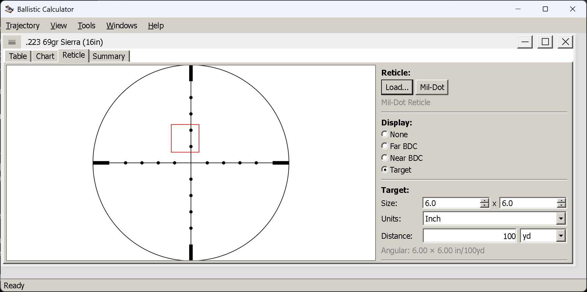

# The reticle view

**Goal of this article:** see the solution as a sight picture — your own reticle with the trajectory
mapped onto it — and use the three overlays it can draw.

The other two views tell you what to hold. This one shows you **where in the reticle that hold lands**,
which is what you are actually doing behind the rifle. Reach it with `Ctrl+R` or
`View → Show → Reticle`.

*A Mil-Dot reticle with the Target overlay: a 6 × 6 in target at 100 yd, drawn to scale, with its angular
size printed underneath.*

## Choosing a reticle

The view starts empty — the name reads **(none)** and there is nothing to draw on.

- **`Mil-Dot`** draws a standard mil-dot reticle in one click — 12 × 12 mrad, dots at whole
  **milliradians**, as a mil-dot reticle's should be. It is built in, so there is no file to find.
- **`Load…`** opens the `data/reticle` folder, which ships with two dozen. They fall into two kinds:
  **measuring grids**, whose marks are places on a ruler — `MILDOT`, `MOA-GRID` (the same field of view in
  minutes), `H58`, and Leupold's `CCH` and `CMR-MIL` christmas trees — and **load-calibrated ladders**,
  whose marks are one load's drops: Trijicon ACOGs (`ACOG-TA31`, `-TA648`, `-TA31-762mm`, the two `TA44`
  RTRs), V-COGs in 5.56, 7.62 and 300 BLK, Huron hunting BDCs at three magnifications, Elcan `SPECTER`s in
  5.56 and 7.62, and Leupold `CMR-W` in 5.56 and 7.62. `GERMAN4`, `PSO-1` and an M16 iron-sight picture
  round it out. `data/reticle/README.md`
  tabulates both kinds and, where the marks are load-calibrated, exactly which load — ammunition, muzzle
  velocity, sight height and zero — with a companion `.md` per reticle giving every mark and its range.
  Your own reticles, built in the separate **Reticle Editor** application, live here too.

The name of the loaded reticle is shown under the buttons, and the reticle stays loaded while you change
overlays.

**One assumption to be aware of:** the picture is drawn at the reticle's own subtension, as its definition
states it. For a **first focal plane** scope that is true at any magnification. For a **second focal
plane** scope the reticle only subtends its nominal values at one magnification — usually maximum — so the
sight picture here corresponds to that setting and not to whatever you happen to be dialled to.

## The three overlays

The **Display** radio buttons choose what is drawn with the reticle. They are exclusive: one at a time.

### None

The reticle alone. Useful for checking a reticle you have just built, or for seeing the bare subtensions.

### Far BDC

Blue distance labels at the points **past your zero**, each sitting at the elevation where that range's
hold falls in the reticle. This turns your reticle into a bullet-drop compensator for *this* load: the
labels say which mark is 400 yd, which is 500 yd, and so on. Each label carries its unit — `552yd` or
`505m` — so a printed sight picture cannot be misread as the other system; the unit follows the window's
measurement system, like everything else on the tab.

### Near BDC

The same labelling for the stretch **before the zero**, where the bullet is still climbing to the sight
line. This is the part shooters usually forget: with a 300 yd zero, a 100 yd target is not on the
crosshair either, and the near marks tell you by how much.

### Where Near stops and Far starts

**`Split at`**, under the radio buttons, is the distance that divides the two. It starts at your **zero**
— the natural place, since that is where the bullet crosses the sight line — and it follows the zero as
you change the shot, in the window's own unit.

It is editable because the zero is the wrong split for some loads. A **.22 LR** zeroed at 50 yd, or a
**subsonic** load, puts almost everything worth labelling on one side of it: *Far* is then a crowd of
marks and *Near* is nearly empty, or the reverse. Setting the split where the marks actually thin out
gives you two readable overlays instead of one useless one.

Two details worth knowing:

- **Once you type a split of your own, it stays yours.** Editing the shot afterwards will not quietly
  put it back to the new zero. Clear the field to go back to following the zero.
- The box is enabled only while **Far BDC** or **Near BDC** is selected; it changes nothing in the other
  two modes.

Both BDC overlays are computed from a **fine trajectory** — 2.5 m steps, out to at least 3,000 m (or your
`Maximum Distance` if you set it further) — independently of the `Step` you set for the table. Making the
table coarser will not coarsen the marks. Loads that run out of speed sooner stop where the bullet stops:
the engine ends a run below 50 ft/s or past 10,000 ft of drop, so marks simply cease past that point.

### Target

Draws a target box to scale, at a distance, **behind** the reticle lines, so it reads like a real sight
picture rather than a diagram.

| Control | Notes |
|---|---|
| **Size** | Width × height of the target |
| **Units** | `Inch` or `Centimeter` — this is its own choice, independent of the window's measurement system |
| **Distance** | In the window's unit: yd or m |

Underneath, the panel reports the target's **angular size** in your chosen angular unit — for example
`Angular: 6.00 × 6.00 in/100yd`. That figure is the whole point of the overlay: it tells you whether the
target is big enough to hold on, and it is the number that decides whether a reticle's marks are fine
enough for the shot you are planning.

## Moving targets

Tick **Moving target** inside the Target overlay and two more fields appear: the target's **Direction**,
set by number or by dragging the dial, and its **Speed** in mph or km/h.

The panel then reports the lead as text — `Lead: 1.25 mil left`, say — and draws a **dashed box** at the
aim-off position, offset from the static target by that lead. Aiming at the dashed box is the hold.

The lead is computed from the time of flight to that distance and the target's crossing component, so a
target moving straight toward you needs none, and a target crossing at right angles needs all of it. The
direction convention matches the wind dial's: the readout says *left* or *right* explicitly, so there is
no sign to interpret.

## Building your own reticle

The **Reticle Editor** is a separate application in the same folder (`ReticleEditor.exe` on Windows,
`ReticleEditor` on Linux). It works in the reticle's own angular coordinate space and builds a reticle out
of lines, paths, circles, rectangles, text and BDC marks. Anything it saves into `data/reticle` appears in
this view's `Load…` dialog.

It has four articles of its own: [what it is for](reticle-editor.md),
[size and zero](reticle-parameters.md), [elements](reticle-elements.md) and [paths](reticle-paths.md).

## Things worth knowing

- **No reticle, no picture.** The overlays need a reticle to draw on; load one first.
- **The overlays need a solution.** They are drawn from the current trajectory, so they follow every
  change you make in the Shot Parameters dialog.
- **The angular unit follows `View → Angular Units`.** The target's angular size and the lead readout are
  both expressed in it — a reticle marked in mils is easiest to read with mils selected.
- **A second-focal-plane scope is only true at one magnification.** See above; the drawing cannot know
  what you have dialled.

## Next

[Comparing loads](comparing-loads.md) — putting two solutions on one chart and reading the difference.

*(The summary view, the fourth of the four, is still to be written.)*

---

[← Contents](index.md)
