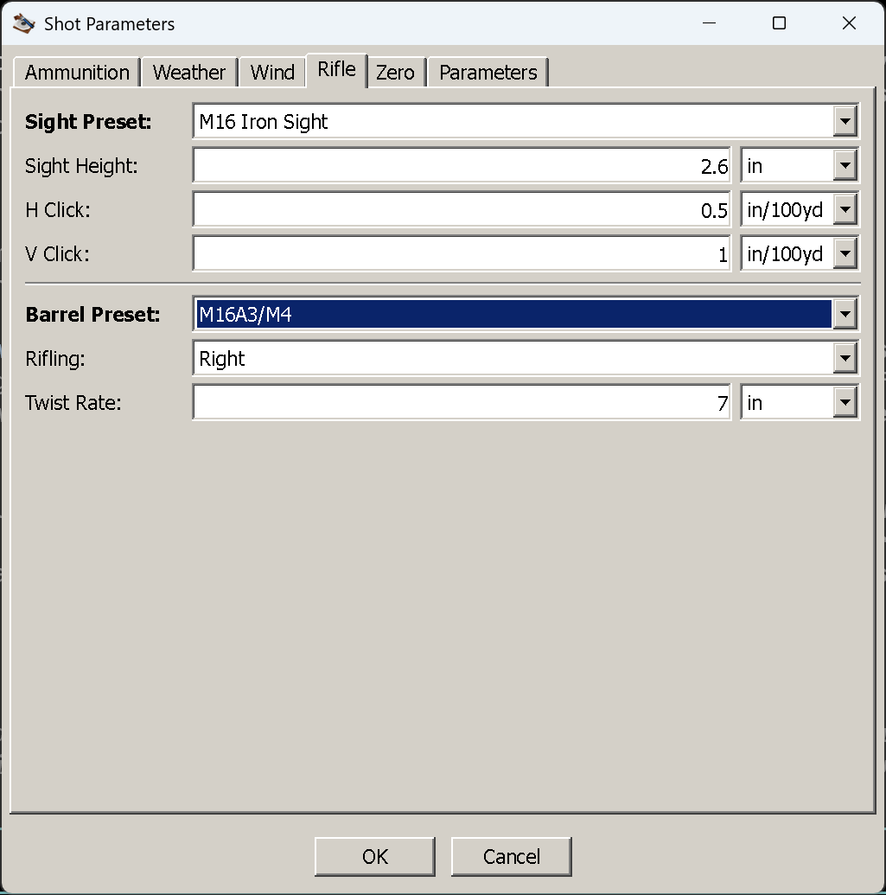

# The Rifle tab

**Goal of this article:** describe the sight and the barrel so that the geometry is right, the clicks in
the table are your clicks, and spin drift and aerodynamic jump can be computed at all.

Two groups, separated by a line: the **sight** above the bore, and the **barrel** that spins the bullet.
Neither is about zeroing — the zero distance lives on its own tab.

*A preset chosen for the sight, another for the barrel.*

## The fields

| Field | Imperial | Metric | What it is |
|---|---|---|---|
| **Sight Preset** | — | — | A named sight from the dictionary; fills the three fields below |
| Sight Height | inch | mm | Height of the line of sight above the bore. The one field this tab cannot do without |
| H Click | angular | angular | Windage per click of your turret. Optional |
| V Click | angular | angular | Elevation per click. Optional |
| **Barrel Preset** | — | — | A named barrel from the dictionary; fills the two fields below |
| Rifling | — | — | Twist direction: *Not Set*, *Left* or *Right* |
| Twist Rate | inch | mm | The distance the bullet travels in one full turn. Disabled until a direction is chosen |

Click values are **angular and not tied to the measurement system** — a metric shooter with an MOA scope
is perfectly normal. The boxes default to mils, and the unit dropdown beside each takes whatever your
turret is marked in: `0.1 mil`, `0.25 moa`, `0.5 in/100yd`.

## Sight height, and why it is not a detail

The sight sits above the bore, so the line of sight and the barrel are two different lines that cross.
Everything about the shape of a trajectory relative to your crosshair follows from that: the bullet
starts below the line of sight, rises through it at the **near zero**, arcs above it, and comes back down
through it at the zero distance you asked for. A taller sight makes the barrel point further up to reach
the same zero, which moves the near zero out and raises the mid-range arc.

Measure it from the **centre of the bore to the centre of the scope tube** — not to the top of the
turret, and not to the bottom of the objective. On an AR-pattern rifle it is around 2.6 in; on a bolt gun
with a normal mount, 1.5 to 1.8 in.

It is also the one field on this tab you cannot leave out. Enter click values without a sight height and
OK reports *"Not all required data filled in: Rifle"* — the sight has no geometry without it. Leave the
whole tab alone and the default is a **3 in sight height with no clicks and no rifling**.

## Presets, and where they come from

The two preset dropdowns read `data/dictionaries.xml`, the file that ships beside the application.
Choosing a sight fills the height and both click values; choosing a barrel fills the direction and twist
rate. The shipped list covers common service and sporting rifles — `M16A3/M4` at 1:7 in, `AK-74` at
200 mm, `Standard Optics (High, Mil)` at 3 in with 0.1 mil clicks, `EOTech@M4` at 2.6 in, and so on.

Three behaviours worth knowing:

- **A sight preset can also set your zero distance.** Most shipped sights carry a default zero (25 yd for
  the .22LR entries, 100 yd for the rest), and selecting one writes it straight into the Zero tab —
  overwriting whatever was there. **So pick the sight preset first, then set your zero distance**, not the
  other way round.
- **Editing a field does not fight the dropdown.** The combo falls back to *(select)* only once a value
  no longer matches the preset it came from, so a preset stays named while it is still true and stops
  claiming credit as soon as you change something.
- **You can add your own.** `Tools → Edit Sights…` and `Tools → Edit Barrels…` edit the same dictionary
  and save it to `user-dictionaries.xml`, beside the executable. Worth doing once for each rifle you
  actually shoot — and an update cannot overwrite it, though it will add any new presets a release brings
  (see [Updating the application](updating.md)).

## Click values buy you two things

They are optional, and the trajectory is identical without them — but:

- **The two *Clicks* columns in the table** convert the elevation and windage corrections into turret
  clicks. Without click values, both columns read **n/a**; the corrections themselves are still there in
  the adjustment columns, in whatever angular unit you chose under `View → Angular Units`.
- **Dialled clicks on the Parameters tab.** If you have already cranked 12 clicks of elevation onto the
  turret, that tab takes the count and needs the click size to turn it into an angle.

Enter them separately for H and V because some scopes genuinely differ, and because a windage turret and
an elevation turret can be marked in different steps.

Note that click size and **`View → Angular Units` are unrelated**. The angular unit decides how holds and
corrections are *displayed*; the click size describes your hardware. A metric shooter with 0.25 MOA
turrets reading holds in mils is a perfectly coherent setup.

## The barrel: what the twist actually buys

The rifling group is what makes two correction terms computable:

- **Spin drift** — a spin-stabilised bullet drifts sideways in the direction of its spin, growing with
  roughly the 1.8th power of time of flight. That exponent is the important part: it is nothing you could
  measure at 100, and inches at 1,000.
- **Crosswind aerodynamic jump** — a vertical shift imparted at the muzzle by a crosswind, whose size
  depends on the bullet's stability and length in calibres.

Both need **three** things, and it is the combination people miss: the **twist** (here), plus the
bullet's **diameter and length** (on the [Ammunition tab](ammunition-tab.md#when-diameter-and-length-are-needed)).
Leave any one of them out and **both terms are silently absent** — no warning, just a different
trajectory. The windage column then contains wind and nothing else.

**Direction is not cosmetic.** A right-hand twist drifts the bullet right, a left-hand twist drifts it
left, and the same sign flips the direction of aerodynamic jump. Since the windage column carries wind
and spin drift **together**, the two can partly cancel: a right-twist rifle in a wind coming from your
right is being pushed left by the air and right by the spin, and at some distance those are equal.

Twist rate is entered as the **distance for one full turn** — a 1:7 in barrel is `7 in`, an AK-74 is
`200 mm`. Smaller number, faster twist. The **Twist Rate** box stays greyed out until you pick a
direction, because a twist rate with no direction cannot say which way the bullet drifts; leaving
*Rifling* at *Not Set* is how you say "I do not know the twist", and it is the honest answer if you do
not.

## Things that catch people out

- **Clicks entered, sight height forgotten.** The tab is rejected, and the message names the tab rather
  than the field.
- **A sight preset chosen after the zero distance.** It overwrites the zero.
- **Twist entered, bullet dimensions not.** Spin drift and aerodynamic jump still do not happen; the
  twist alone is not enough.
- **Sight height measured to the wrong place.** Centre of bore to centre of tube.
- **Expecting the *Clicks* columns to work without click values.** They read n/a; that is the field
  asking to be filled in.
- **A custom dictionary lost on upgrade.** `data/dictionaries.xml` is shipped, so a fresh archive
  replaces it.

## Next

[The Zero tab](zero-tab.md) — zero distance, impact offset, and zeroing with a different cartridge,
atmosphere or wind than the shot.

---

[← Contents](index.md)
