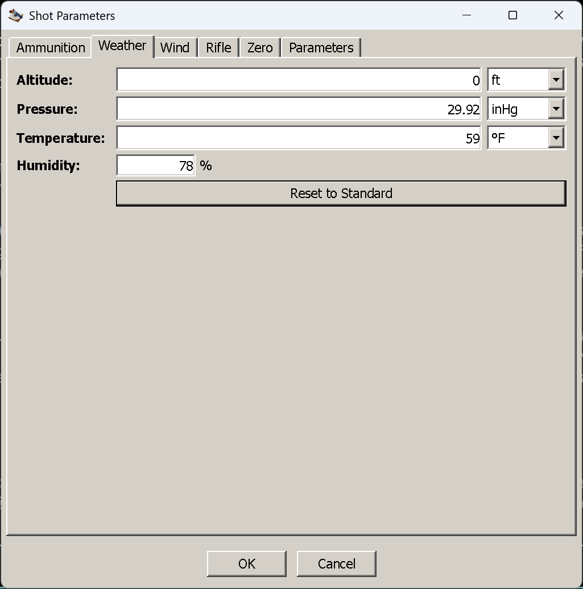

# The Weather tab

**Goal of this article:** describe the air the bullet flies through, without making the one mistake that
quietly ruins a long-range solution — feeding it a sea-level pressure as if it were the pressure where
you are standing.

Air is what makes external ballistics hard: denser air means more drag, less velocity, more drop and
more wind deflection. Four numbers describe it here, and the tab is one of the five that has a usable
default, so you can ignore it entirely on a first run.

*Standard conditions in an imperial window.*

## The fields

All four are required together: fill in one and you have to fill in all of them, or the dialog will
report the tab as incomplete when you press OK. Leave the whole tab alone and it uses the standard
atmosphere.

| Field | Imperial | Metric | What it is |
|---|---|---|---|
| **Altitude** | foot | metre | Your height above sea level — the shooting position, not the target |
| **Pressure** | inHg | hPa | The air pressure **at that altitude**. See below; this is the field that catches people |
| **Temperature** | °F | °C | Air temperature at the shooting position |
| **Humidity** | % | % | Relative humidity, 0 to 100 |

**Reset to Standard** fills in the ICAO standard atmosphere: sea level, 29.92 inHg / 1013.2 hPa,
59 °F / 15 °C, 78 % humidity. It is the fastest way to get back to a known baseline after
experimenting.

## Station pressure, not sea-level pressure

This is the one that matters. The pressure field is the **station pressure** — the pressure of the air
around you, at the altitude you entered. It is not corrected, and the application does not ask whether
your figure is corrected.

The trap is that most published pressures *are* corrected. An aviation altimeter setting (QNH), the
"pressure" in a weather app, and the barometric reading on a TV forecast are all normalised to sea level
so that they can be compared between places. At 5,000 ft, a sea-level-corrected 29.92 inHg corresponds
to roughly 24.9 inHg of real air. Enter the corrected figure with an altitude of 5,000 ft and you have
described air about 20 % denser than what you are shooting through — which, at distance, is a miss you
cannot explain from the ballistics.

So:

- **A Kestrel or any absolute barometer** reads station pressure. Enter it as it is.
- **A weather report, a phone app or an altimeter setting** is almost always sea-level-corrected. Either
  convert it to station pressure for your altitude, or ignore it and use the standard atmosphere at your
  altitude instead — which is what the altitude field is for.

**Altitude and pressure are not two ways of saying the same thing.** Altitude affects the air the bullet
meets along the way, and it also feeds the density the solver derives from your pressure and
temperature. It is not a substitute for measuring the pressure, and the pressure is not a substitute for
telling the application how high you are.

## Temperature and humidity

**Temperature** does two things: it changes air density — cold air is denser, so drag is higher — and it
sets the speed of sound, which decides where the transonic region falls. That second effect is why the
Mach column in the table moves when you change nothing but the temperature.

Temperature also changes your muzzle velocity, through the propellant rather than the air, and **the
application does not model that**. A load chronographed at 20 °C does not leave the barrel at the same
speed at −10 °C. If you know your load's temperature sensitivity, apply it yourself on the
[Ammunition tab](ammunition-tab.md) by entering the muzzle velocity you actually expect on the day.

**Humidity** is the one number here that barely earns its place. Humid air is very slightly *less* dense
than dry air at the same pressure and temperature, and across the full 0–100 % range the effect on drop
is a fraction of what a 5 °C temperature error does. Enter it if you know it; do not go looking for it.

## Leaving it empty

If you never open the tab, OK offers you the default and the shot runs in **standard sea-level air**:
15 °C / 59 °F, 78 % humidity, one atmosphere. That is a legitimate way to work — it is what published
ballistic tables assume, and it makes two loads comparable — but it is not your air unless you happen to
be at sea level on a mild day.

(A pedantic detail, in case you compare the two: the default's pressure is 29.95 inHg where *Reset to
Standard* writes the ICAO 29.92 inHg. The difference is 0.1 %, far below anything you could measure or
shoot, but it is why the two are not bit-identical.)

## Things that catch people out

- **A sea-level pressure entered with a real altitude.** The single biggest error available on this tab.
- **Filling in three fields and not the fourth.** The tab is all-or-nothing; OK will say so.
- **Expecting a cold-weather velocity drop.** The air is modelled, the propellant is not.
- **A humidity typed with a comma.** The humidity box wants a plain number with a dot if you use
  decimals; a comma is not accepted, and the tab then reads as incomplete.

## Next

[The Wind tab](wind-tab.md) — the other half of the air, and the one that moves the bullet sideways.

---

[← Contents](index.md)
