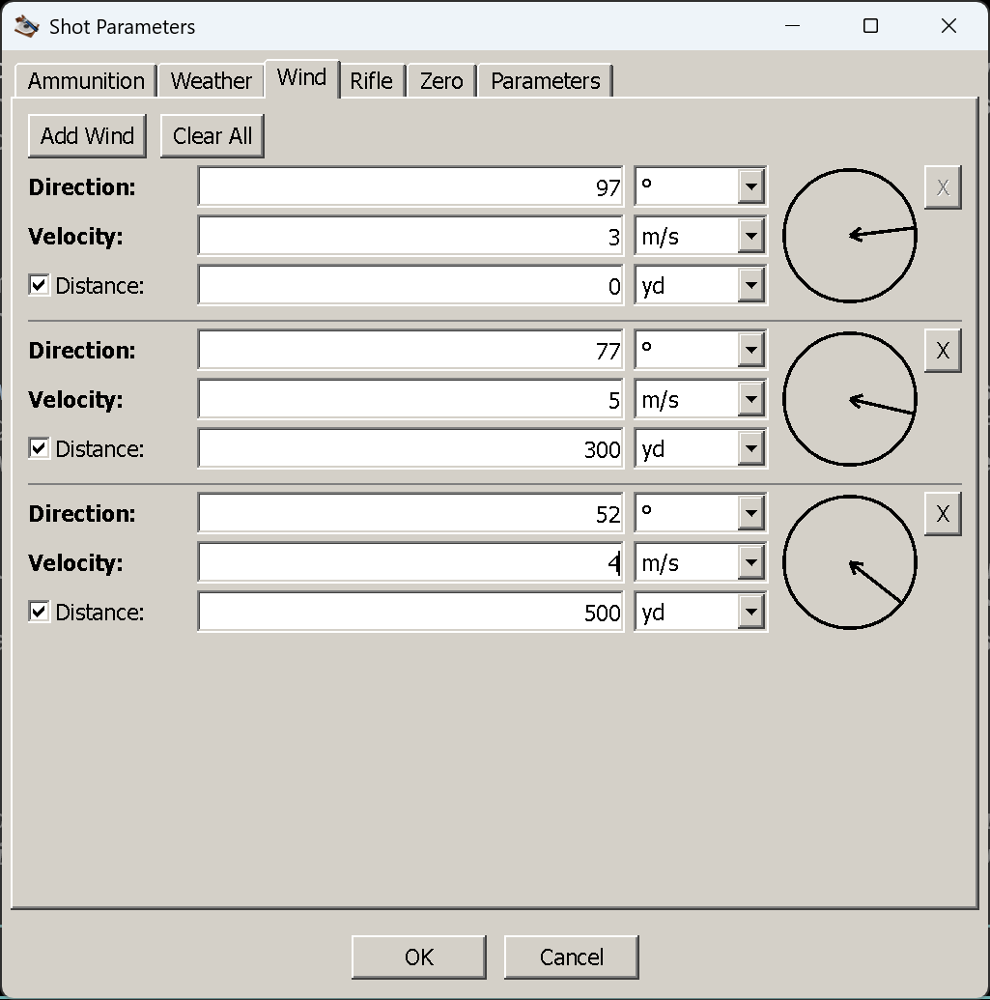

# The Wind tab

**Goal of this article:** enter the wind so that the windage number means something — the direction
convention, and what a zone's distance actually does.

Wind is the error that dominates at distance. Unlike drop, it cannot be dialled from a table in advance,
because it changes between the muzzle and the target and between one shot and the next. This tab lets you
describe it as one wind or as several zones along the flight path.

*Three zones, metric window. Each row has a direction dial on the right and an `X` to remove it.*

## One row per wind

Each row is one wind: **Direction**, **Velocity**, and the **distance at which it starts**. Both
direction and velocity are required for the row to count; a row left blank is ignored rather than treated
as calm.

| Field | Imperial | Metric | Notes |
|---|---|---|---|
| **Direction** | degrees | degrees | Always degrees, in both systems — it is not a measurement-system quantity. The dial beside it does the same job |
| **Velocity** | mph | m/s | |
| Distance | yard | metre | Where this wind **starts**. See [zones](#zones-the-distance-is-where-a-wind-starts) |

**Add Wind** appends a row, copying the direction and velocity from the row above and offering a distance
100 further out — so building a three-zone wind is three clicks and a few edits. **Clear All** returns to
a single empty row. Every row after the first has an `X` to remove it; the first row's `X` is disabled,
because a wind needs at least one row to exist in.

Leave the tab untouched and the shot is computed in **still air**.

## Direction: 0 is downrange, and it is relative to your line of fire

The direction is measured **clockwise from downrange**, in the same sense as a clock face laid over the
shot with the target at 12:

| Enter | Wind | Clock | Effect |
|---|---|---|---|
| **0°** | from behind you, blowing toward the target | 6 o'clock | A tailwind. No sideways push; very slightly less drag |
| **90°** | from your right, blowing to the left | 3 o'clock | Full crosswind, bullet pushed left |
| **180°** | from in front, blowing toward you | 12 o'clock | A headwind. No sideways push; very slightly more drag |
| **270°** | from your left, blowing to the right | 9 o'clock | Full crosswind, bullet pushed right |

**The dial is the safest way to read this.** The arrow points the way the air is moving, and its tail
sits on the side the wind is coming from: an arrow entering from the right edge and crossing to the
centre is a wind from your right. You can click or drag on the dial to set the direction, and the number
follows; type in the box and the dial follows.

Two things worth being explicit about:

- **It is relative to the line of fire, not to north.** 90° is "from my right", whatever compass bearing
  you are facing. The only place a compass bearing is entered is the Coriolis group on the Parameters
  tab, which is a different effect entirely.
- **It is not the meteorological convention.** A forecast saying "wind from the west" names the direction
  the air comes *from* as a compass bearing; here you enter, in degrees from downrange, the direction the
  air is *going*. If you are facing north and the wind is westerly, it crosses you from the left, so it
  blows toward your right: **270°**.

A head or tail wind is not entirely free, by the way. It changes the airspeed the bullet sees, so it
changes drag: on a .223 69 gr at 500 yd, a 10 mph wind is worth about 20 ft/s of retained velocity
between a pure tailwind and a pure headwind. It is a small effect next to the sideways push of the same
wind, and it is the reason the velocity column moves when you switch a wind between 0° and 180°.

## Zones: the distance is where a wind starts

A single row with a distance of **0** is one wind over the whole trajectory — the usual case, and the
only one most shots need.

With more rows, each row's wind acts **from its own distance until the next row's distance**, and the
last row holds to the end of the trajectory:

| Rows | Meaning |
|---|---|
| `0` → 5 m/s | 5 m/s the whole way |
| `250 m` → 5 m/s | **No wind at all until 250 m**, then 5 m/s for the rest of the flight |
| `0` → 3 m/s, `300 m` → 5 m/s | 3 m/s from the muzzle to 300 m, then 5 m/s onwards |
| `0` → 3 m/s, `300 m` → 5 m/s, `500 m` → 4 m/s | 3 m/s to 300 m, 5 m/s from 300 to 500 m, 4 m/s beyond 500 m |

So a row is read as "this wind, from here on". To make a wind **stop**, add a row at the distance it
stops with a velocity of 0 — that is what a calm stretch is, a zone with no wind in it. The same applies
in reverse: a first row starting at 250 m means the first 250 m are calm.

Rows do not have to be typed in order of distance; they are sorted before the shot is computed.

## When zones are worth the trouble

Rarely, and it is worth knowing why. Wind deflection is not proportional to the wind — it is
proportional to the wind *and* to the time the bullet still has left to be pushed. Wind near the muzzle
acts on a bullet that has its whole flight ahead of it; wind near the target acts on one that is about to
arrive. A crosswind over the first third of the flight deflects far more than the same crosswind over the
last third.

Which means:

- **If you can only judge one wind, judge the one at your position** and enter it as a single zone from
  0. It is the one that matters most, and it is the one you can actually feel.
- **Zones earn their keep when the terrain says so** — shooting out of a sheltered position into an open
  valley, across a gap between two ridges, along a treeline that ends partway. Those are cases where you
  have real information that the wind downrange is different, not merely a suspicion.
- **Do not invent zones to express uncertainty.** Three guessed zones are not more accurate than one
  measured wind; they just look more precise. If you want to know what your wind-reading error is worth,
  that is what the hit-probability tool's wind-estimation error input is for.

One more asymmetry, if you have entered the rifling and the bullet's dimensions: **crosswind aerodynamic
jump is imparted at the muzzle**, so it is computed from the **first zone only**. A wind that starts
downrange produces no jump at all, however strong it is.

## Things that catch people out

- **Meteorological "wind from" versus this tab's "blowing toward".** They differ by 180°. When in doubt,
  read the dial.
- **A row with a distance but no direction or velocity.** It is ignored, not treated as calm. To make a
  stretch calm, enter a velocity of 0.
- **Expecting a first row at 250 m to mean "wind up to 250 m".** It means the opposite: calm until 250 m.
- **Zones without information.** Guessed zones add precision, not accuracy.

## Next

[The Rifle tab](index.md#all-articles) — sight height, click values and the twist that makes spin drift
computable. Still to be written.

---

[← Contents](index.md)
