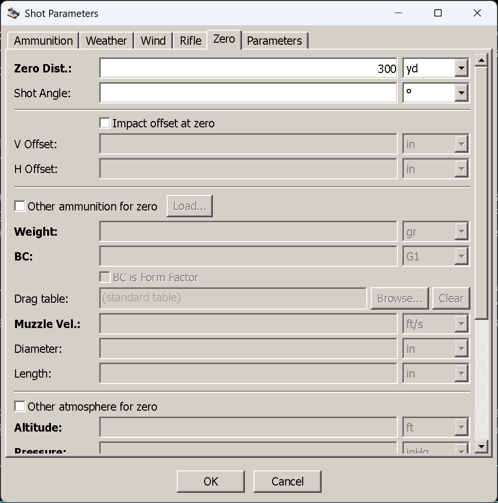
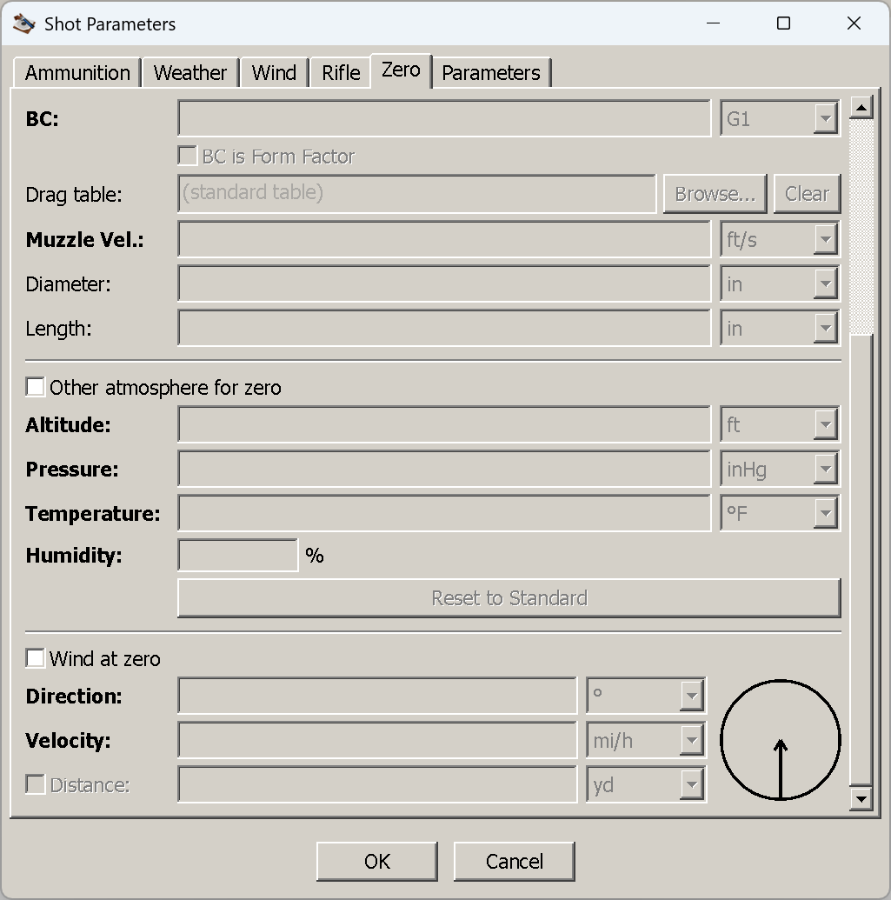

# The Zero tab

**Goal of this article:** tell the application where your rifle is sighted in — and know when that is one
number and when it is a description of the day you sighted it in.

## The application solves for the zero

Most of this tab makes sense only once one idea lands. Other solvers ask you for a **sight angle**, or
for a table of clicks you measured. This one asks you to **describe the zeroing event**, and then
computes the sight angle that would have produced it: it runs a full trajectory at the zero distance, in
the zeroing conditions, with the zeroing load, and searches for the barrel elevation and windage that put
the bullet on the aim point.

That is why the tab has more on it than a distance. A zero is not a property of the rifle alone — it is
the angle between the sight line and the bore that *some particular afternoon on some particular range
with some particular ammunition* left you with. The more that afternoon differed from the shot you are
now computing, the more of it you have to describe here.

*The tab scrolls; this is the top of it. The optional groups are unchecked, so their fields are greyed.*

## The fields

| Field | Imperial | Metric | What it is |
|---|---|---|---|
| **Zero Dist.** | yard | metre | The distance you sighted in at. The only field the tab needs |
| Shot Angle | degrees | degrees | The angle you were shooting at **while zeroing**, not the angle of this shot |
| Impact offset at zero | — | — | Checkbox enabling the two fields below |
| V Offset | inch | mm | How far the group printed from the aim point at that distance. **Positive is up** |
| H Offset | inch | mm | Same, sideways. **Positive is left** — matching the windage column's sign |
| Other ammunition for zero | — | — | Group: a different load was used to zero. Has its own `Load…` |
| Other atmosphere for zero | — | — | Group: different air, with its own *Reset to Standard* |
| Wind at zero | — | — | Group: there was a wind while zeroing |

Left completely empty, the tab defaults to **100 yd** or **100 m**. If you picked a sight preset on the
[Rifle tab](rifle-tab.md#presets-and-where-they-come-from), the zero distance may already be filled in —
presets carry one, and selecting a preset overwrites this field.

## Scenario 1: the ordinary zero

**When it applies:** you sighted in with the load you are computing, on a level range, in no meaningful
wind, in air not wildly different from the air you are shooting in now. That is most of the shooting most
people do, and it needs exactly one number.

1. Enter **Zero Dist.** — 100 m, 100 yd, 200 yd, whatever you actually did.
2. Leave everything else alone. Do not tick anything.
3. Press OK.

The drop column now reads zero at that distance, negative beyond it, and the near zero appears somewhere
short of it. That is all there is to it.

### What "leave everything else alone" actually means

This is the part worth understanding, because the default is not the obvious one. With the three groups
unchecked, the application zeroes your rifle with:

- the **same ammunition** as the shot,
- the **same atmosphere** as the shot — whatever you entered on the [Weather tab](weather-tab.md),
- **no wind**, and **level**.

Note the second one. Unchecked does **not** mean "standard conditions" — it means **"the same conditions
as the shot"**. So if you tell the Weather tab you are at 5,000 ft at −10 °C, the application computes
your zero *in that air too*: it assumes you re-zeroed this morning, where you are standing now.

Usually that is harmless, and it is worth knowing why. The zero is a sight *angle*, recovered from a short
shot. Over 100 m, air density changes the drop by a fraction of a millimetre, so the angle it recovers is
the same angle to more decimal places than your turret has clicks. The assumption only starts to bite
when the zeroing shot is long enough for conditions to have moved it — and it becomes wrong in a way you
can measure when the *load* differs, because that changes the trajectory over the zero distance a great
deal more than the weather does.

Which is the whole of scenario 2.

## Scenario 2: the zero that was not established under these conditions

**When it applies:** whenever the zeroing event differed from the shot in a way that changed where the
bullet landed at the zero distance. Four groups cover it, and they are worth taking one at a time,
because they matter very unequally.

*The bottom of the same tab, reached by scrolling: the rest of the zero-ammunition fields, the zero
atmosphere, and the zeroing wind.*

### Other ammunition for zero — the one that really matters

Tick it and you get the same fields as the [Ammunition tab](ammunition-tab.md) minus the descriptive
block: weight, BC and drag table, the form-factor switch, a custom `.drg`, muzzle velocity, diameter and
length. `Load…` pulls a saved `.ammox` or legacy `.ammo` in, so a load you have already saved takes one
click.

**When you need it:**

- **Zero supersonic, shoot subsonic.** The classic, and the case this application handles that few free
  solvers do. You zero a .300 Blackout at 100 yd with a 125 gr supersonic load, then screw on a can and
  shoot the 220 gr subsonic. The subsonic round drops several feet where the supersonic dropped inches —
  but the *sight angle* is the supersonic load's, and the subsonic trajectory has to be computed from
  that angle. Describe the supersonic load here and the shot's own load on the Ammunition tab, and the
  drop column tells you the truth. Get it wrong and the numbers are not slightly off, they are useless.
- **You zeroed with the cheap stuff.** Sighted in on bulk ammunition, shooting match ammunition. Same
  idea, smaller magnitude.
- **You are reproducing someone else's data** — a rifle zeroed by someone else, with a load you know.

### Other atmosphere for zero — matters at long zero distances

Its own altitude, pressure, temperature and humidity, with a *Reset to Standard* button.

**When you need it:**

- **A long zero and a big change in conditions.** Zeroed at 300 m at sea level in summer, shooting at
  2,000 m altitude in winter. The further out the zero, the more the air had to say about where that
  group landed, and the more the recovered angle moves.
- **A short zero and any conditions.** Not worth the typing. At 100 m you are correcting the fourth
  decimal place of an angle.
- **Reproducing published or standard-atmosphere data**, where the point is to state the conditions the
  zero belongs to rather than to reflect your own day.

### Wind at zero — only if you dialled a wind out

One wind: direction, velocity, and a start distance pinned to 0, because a zeroing shot is short and
controlled and splitting it into zones would be nonsense. It blows for the whole zeroing shot.

**When you need it:** you sighted in in a real crosswind and adjusted the windage until the group was
centred. Your windage zero then has that wind baked into it, and every shot you compute afterwards
inherits the bias. Telling the application reproduces it, so it can subtract it.

**When you do not:** you zeroed in still air, or in a wind light enough that you would not have chased it
with the turret. Leaving this off means "no wind while zeroing", which is what you want.

### Shot Angle — for a zero established on a slope

The angle you were shooting at *while zeroing*. Almost always 0, because almost everyone zeroes on a flat
range; fill it in only if you genuinely sighted in up or down a slope. **This is not the angle of the shot
you are computing** — that lives on the Parameters tab, and confusing the two puts the angle in the wrong
half of the problem.

### Impact offset at zero — for a zero that is deliberately not centred

Tick **Impact offset at zero** and enter where the group actually sits relative to your aim point at the
zero distance. **V Offset is positive up**, **H Offset is positive left**.

**When you need it:**

- **A deliberate offset zero.** "Two inches high at 100" is a real and common way to zero a hunting
  rifle; enter `2 in` and the application takes it as the zero condition rather than pretending you were
  centred.
- **A known bias you have not corrected.** The rifle prints an inch left at 100 and you have run out of
  windage adjustment, or you simply have not touched it. Enter it and the solution accounts for it.

**When you do not:** if you centred the group, leave it off. And if your rifle prints off-centre because
of something you *can* fix, fix it rather than describing it — this field propagates the bias to every
distance, which is exactly what it is for and exactly what you do not want to enshrine by accident.

## Deciding whether any of it matters

A short hierarchy, most significant first:

1. **Different load at zero** — always model it. Changes the answer by feet at distance.
2. **A deliberate offset zero** — always model it. It is a fixed bias at every range.
3. **A crosswind you dialled out** — model it if it was real. It is a windage bias at every range.
4. **Different air at zero** — model it if the zero distance is long (300 and up) or the conditions
   differ dramatically. Skip it for a 100 m zero.
5. **A zero established on a slope** — rare enough that if you are not sure, you were on a flat range.

Everything on this tab is you telling the application the truth about one afternoon. If nothing about that
afternoon differed from the shot you are computing, one number is the whole truth.

## Things that catch people out

- **A ticked group with a field missing is silently ignored.** Tick *Other ammunition for zero*, forget
  the weight, and the shot computes with the zero using the **shot's** ammunition instead. Nothing warns
  you, because the group reads as "nothing entered" rather than as "half entered".
- **Unchecked means "same as the shot", not "standard".** The most common misreading of this tab.
- **A zero distance the load cannot reach.** Ask a subsonic pistol load for a 1,000 yd zero and the
  calculation fails rather than returning a very silly number.
- **The sight preset overwrites the zero distance.** Pick the preset first, then set the distance.
- **The tab scrolls.** The zero atmosphere and the zeroing wind are below the fold; if you cannot find
  them, scroll.
- **Zero shot angle versus shot angle.** This tab's angle describes the zeroing; the Parameters tab's
  describes the shot.

## Next

[The Parameters tab](index.md#all-articles) — maximum range and step, this shot's angle, dialled clicks
and the Coriolis effect. Still to be written.

---

[← Contents](index.md)
